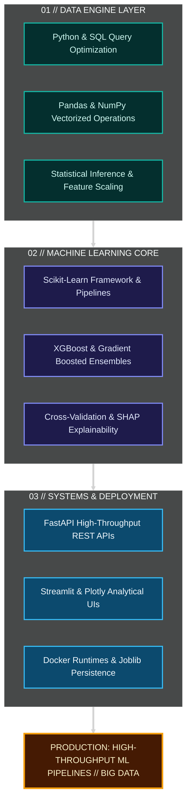

<div align="center">

<!-- ================================================================= -->
<!-- 01. ANIMATED 3D COMMAND CENTER HERO                              -->
<!-- ================================================================= -->

<a href="https://github.com/manikantapalla2728">
  
</a>

<br/>

<!-- VIBRANT 3D STATUS PILLS -->
<p align="center">
  
  
  
  
  
</p>

### <b>B.Tech Computer Science &amp; Engineering &bull; Artificial Intelligence &amp; Machine Learning Specialization</b>

<p align="center">
  <em>"Transforming raw, noisy data into calibrated, high-performance predictive systems and production-grade software services."</em>
</p>

<!-- 3D ELEVATED NAVIGATION -->
<table align="center">
  <tr>
    <td align="center">
      <a href="#profile-core"><b>⚡ 01. Core Architecture</b></a> &bull;
      <a href="#system-stack"><b>🛠️ 02. System Stack</b></a> &bull;
      <a href="#skill-layers"><b>📐 03. 3D Skills Matrix</b></a> &bull;
      <a href="#ml-pipeline"><b>🔄 04. ML Pipeline</b></a> &bull;
      <a href="#projects"><b>🚀 05. Featured Projects</b></a> &bull;
      <a href="#problem-solving"><b>🧩 06. DSA &amp; CP</b></a> &bull;
      <a href="#experience"><b>💼 07. Simulations</b></a> &bull;
      <a href="#hackathons"><b>🏆 08. Hackathons</b></a> &bull;
      <a href="#credentials"><b>📜 09. Credentials</b></a> &bull;
      <a href="#roadmap"><b>🗺️ 10. 3D Roadmap</b></a> &bull;
      <a href="#contact"><b>📬 11. Contact</b></a>
    </td>
  </tr>
</table>

---

</div>

<br/>

<!-- ================================================================= -->
<!-- 03. SYSTEM STACK (VIBRANT & COLORFUL BADGES)                     -->
<!-- ================================================================= -->

<a id="system-stack"></a>
## 🛠️ SYSTEM STACK

A battle-tested technical arsenal engineered for data modeling, algorithms, and production services:

<br/>

### 💻 Programming Languages
<p align="left">
  
  
  
  
  
</p>

### 📊 Data Science & Machine Learning
<p align="left">
  
  
  
  
  
  
</p>

### 👁️ Computer Vision & Biometrics
<p align="left">
  
  
  
</p>

### ⚙️ Web Frameworks & ML Engineering
<p align="left">
  
  
  
  
  
</p>

### 🗄️ Databases & Tooling
<p align="left">
  
  
  
  
  
</p>

<br/>

---

<!-- ================================================================= -->
<!-- 02. PROFILE CORE & ARCHITECTURAL SCHEMATIC                       -->
<!-- ================================================================= -->

<a id="profile-core"></a>
## ⚡ PROFILE CORE ARCHITECTURE

My engineering perspective treats machine learning not merely as calling `.fit()` and `.predict()`, but as a **disciplined end-to-end discipline**: schema validation, leakage-free feature engineering, cross-validated algorithmic benchmarks, post-hoc explainability (SHAP), and containerized microservice deployment.

```
       ┌────────────────────────────────────────────────────────────────────────┐
       │                 MANIKANTA PALLA // CORE ARCHITECTURE                   │
       └───────────────────────────────────┬────────────────────────────────────┘
                                           │
       ┌───────────────────────────────────┼────────────────────────────────────┐
       ▼                                   ▼                                    ▼
 ╔═══════════════════════╗       ╔═══════════════════════╗       ╔═══════════════════════╗
 ║    01. DATA ENGINE    ║       ║   02. ML CORE         ║       ║   03. SYSTEMS & OPS   ║
 ╠═══════════════════════╣       ╠═══════════════════════╣       ╠═══════════════════════╣
 ║ • Python & SQL        ║       ║ • Scikit-Learn        ║       ║ • FastAPI REST        ║
 ║ • Pandas & NumPy      ║ ────► ║ • XGBoost & Trees     ║ ────► ║ • Docker Containers   ║
 ║ • Statistical Math    ║       ║ • PCA & Ensembles     ║       ║ • Streamlit Dashboards║
 ║ • Preprocessing Pipes ║       ║ • SHAP Explainability ║       ║ • MySQL & MongoDB     ║
 ╚═══════════════════════╝       ╚═══════════════════════╝       ╚═══════════════════════╝
                                           │
                                           ▼
       ┌────────────────────────────────────────────────────────────────────────┐
       │          PRODUCTION CONVERGENCE: REPRODUCIBLE ML & BIG DATA            │
       └────────────────────────────────────────────────────────────────────────┘
```



<br/>

---


<!-- ================================================================= -->
<!-- 04. 3D STRATIFIED SKILLS MATRIX                                  -->
<!-- ================================================================= -->

<a id="skill-layers"></a>
## 📐 3D STRATIFIED SKILLS MATRIX

A layered architectural model highlighting skills from core machine execution to containerized microservices:

<table>
  <thead>
    <tr>
      <th width="15%">Layer Tier</th>
      <th width="30%">Domain Specialization</th>
      <th width="55%">Tactile Hardware Skills (<kbd>3D Keys</kbd>)</th>
    </tr>
  </thead>
  <tbody>
    <tr>
      <td><b style="color:#38bdf8;">LAYER 01</b></td>
      <td><b>Programming Fundamentals</b></td>
      <td>
        <kbd>Python (OOP &amp; Scripts)</kbd> &bull;
        <kbd>Java (Core &amp; DSA)</kbd> &bull;
        <kbd>C++ (STL)</kbd> &bull;
        <kbd>C (Pointers)</kbd>
      </td>
    </tr>
    <tr>
      <td><b style="color:#06b6d4;">LAYER 02</b></td>
      <td><b>Data Engine &amp; Stats</b></td>
      <td>
        <kbd>SQL (Complex Joins &amp; Windowing)</kbd> &bull;
        <kbd>Pandas</kbd> &bull;
        <kbd>NumPy</kbd> &bull;
        <kbd>Statistics</kbd> &bull;
        <kbd>Excel</kbd>
      </td>
    </tr>
    <tr>
      <td><b style="color:#60a5fa;">LAYER 03</b></td>
      <td><b>Machine Learning &amp; AI</b></td>
      <td>
        <kbd>Scikit-Learn</kbd> &bull;
        <kbd>XGBoost</kbd> &bull;
        <kbd>Ensemble Trees</kbd> &bull;
        <kbd>PCA</kbd> &bull;
        <kbd>SHAP Values</kbd>
      </td>
    </tr>
    <tr>
      <td><b style="color:#818cf8;">LAYER 04</b></td>
      <td><b>ML Engineering &amp; Ops</b></td>
      <td>
        <kbd>FastAPI</kbd> &bull;
        <kbd>Streamlit</kbd> &bull;
        <kbd>Docker</kbd> &bull;
        <kbd>Joblib</kbd> &bull;
        <kbd>Pickle</kbd> &bull;
        <kbd>GridSearchCV</kbd>
      </td>
    </tr>
    <tr>
      <td><b style="color:#14b8a6;">LAYER 05</b></td>
      <td><b>Computer Vision</b></td>
      <td>
        <kbd>OpenCV</kbd> &bull;
        <kbd>face_recognition</kbd> &bull;
        <kbd>dlib (128-d Vector Encodings)</kbd>
      </td>
    </tr>
    <tr>
      <td><b style="color:#f59e0b;">LAYER 06</b></td>
      <td><b>Database Architecture</b></td>
      <td>
        <kbd>MySQL (Relational ACID)</kbd> &bull;
        <kbd>MongoDB (NoSQL Collections)</kbd>
      </td>
    </tr>
    <tr>
      <td><b style="color:#a78bfa;">LAYER 07</b></td>
      <td><b>Development &amp; Tooling</b></td>
      <td>
        <kbd>Flask</kbd> &bull;
        <kbd>Git &amp; GitHub (Branching)</kbd> &bull;
        <kbd>VS Code Environment</kbd>
      </td>
    </tr>
  </tbody>
</table>

<details open>
<summary><b>🔍 View Granular Technical Breakdown</b></summary>
<br/>

* **Algorithms Worked With:** Linear/Ridge/Lasso Regression, Logistic Regression, K-Nearest Neighbors (KNN), Naive Bayes, Decision Trees, Random Forests, AdaBoost, Gradient Boosting, Support Vector Machines (SVM), K-Means Clustering, XGBoost, Principal Component Analysis (PCA).
* **ML Pipelines & Preprocessing:** `Pipeline`, `ColumnTransformer`, `StandardScaler`, `LabelEncoder`, `OneHotEncoder`, `GridSearchCV`, Train/Test Split.
* **Core Theoretical Concepts:** Imbalanced Classification, Anomaly Detection, Feature Selection, Cross-Validation, SHAP Model Explainability, Time-Series / Temporal Modeling.

</details>

<br/>

---

<!-- ================================================================= -->
<!-- 05. ML PIPELINE ARCHITECTURE                                      -->
<!-- ================================================================= -->

<a id="ml-pipeline"></a>
## 🔄 END-TO-END ML ENGINEERING PIPELINE

A production-minded ML workflow follows a disciplined, reproducible 10-stage lifecycle:

```
[01 RAW DATA] ──► [02 VALIDATION] ──► [03 PREPROCESS] ──► [04 FEATURE ENG] ──► [05 TRAINING]
                                                                                      │
[10 DEPLOYMENT] ◄── [09 API & APP] ◄── [08 EXPLAIN] ◄── [07 EVALUATION] ◄── [06 TUNING]
```


<br/>

| Stage | Engineering Objectives | Artifacts & Tooling |
| :--- | :--- | :--- |
| **01. Ingestion** | Ingest relational, CSV, and streaming sources with strict schema enforcement. | SQL, CSV, Pandas DataFrames |
| **02. Validation** | Audit missingness ratios, cardinality shifts, and distribution drift. | Statistical checks, Type assertions |
| **03. Preprocessing**| Strict separation of train/test splits; prevent data leakage during scaling/imputation. | `TrainTestSplit`, `StandardScaler` |
| **04. Feature Eng.** | Construct domain ratios, categorical encodings, and PCA dimensionality reduction. | `ColumnTransformer`, `PCA` |
| **05. Training** | Train baseline models through gradient boosted trees and ensemble classifiers. | `Scikit-Learn`, `XGBoost` |
| **06. Tuning** | Hyperparameter grid search over stratified cross-validation folds. | `GridSearchCV`, `K-Fold CV` |
| **07. Evaluation** | Analyze Precision-Recall tradeoffs, ROC-AUC, F1-scores, and confusion matrices. | `roc_auc_score`, `classification_report` |
| **08. Explainability**| Compute feature attribution values to interpret decisions for human analysts. | `SHAP`, Feature Importances |
| **09. Serving** | Package serialized model weights into REST APIs and interactive interfaces. | `Joblib`, `FastAPI`, `Streamlit` |
| **10. Deployment** | Containerize the inference runtime for reproducible, scalable deployment. | `Docker`, Git Version Control |

<br/>

---


<!-- ================================================================= -->
<!-- 07. COMPETITIVE PROGRAMMING / PROBLEM SOLVING ENGINE             -->
<!-- ================================================================= -->

<a id="problem-solving"></a>
## 🧩 PROBLEM SOLVING ENGINE

Data Structures and Algorithms form the foundation of my engineering work. I actively practice algorithmic problem solving across LeetCode, CodeChef, and GeeksforGeeks to maintain sharp time-and-space optimization skills:

```
DSA ENGINE
│
├── LeetCode       ──► [Profile: pallamanikanta]  ──► 100 Days Badge (2025)
├── CodeChef       ──► [Profile: route_king_16]   ──► Contest Rating & Speed DSA
└── GeeksforGeeks  ──► [Profile: Manikanta Palla] ──► Core Data Structures & Systems
```

<br/>

### 📊 Competitive Profiles & Metrics

| Platform | Profile Link | Key Credentials / Focus | Verified Badge / Metric |
| :--- | :--- | :--- | :--- |
| **LeetCode** | [leetcode.com/u/pallamanikanta](https://leetcode.com/u/pallamanikanta/) | Trees, Graphs, DP, Binary Search, Arrays | **🏆 100 Days Badge (2025)** &bull; `[UPDATE_COUNT]` Solved |
| **CodeChef** | [codechef.com/users/route_king_16](https://www.codechef.com/users/route_king_16) | Rated Contests, Math, Greedy, Optimization | **⭐ @route_king_16** &bull; `[UPDATE_RATING]` Rating |
| **GeeksforGeeks** | [geeksforgeeks.org/user/manikantapalla2728](https://www.geeksforgeeks.org/) | Linked Lists, Recursion, CS Core Practice | **🎯 Practice Profile** &bull; `[UPDATE_SCORE]` Score |

> 💡 *Note: To update problem counts or ratings, edit the bracketed `[UPDATE_*]` placeholders above.*

<br/>

---

<!-- ================================================================= -->
<!-- 08. EXPERIENCE / VIRTUAL JOB SIMULATIONS                         -->
<!-- ================================================================= -->

<a id="experience"></a>
## 💼 VIRTUAL JOB SIMULATIONS

*Structured industry project simulations completed via Forage:*

```
┌────────────────────────────────────────────────────────────────────────────────────────┐
│ TATA GROUP // Data Analytics Job Simulation                                           │
│ • Conducted exploratory data analysis and data cleansing on retail business data.      │
│ • Formulated executive-level data visualizations and strategic business insights.      │
└────────────────────────────────────────────────────────────────────────────────────────┘
```

```
┌────────────────────────────────────────────────────────────────────────────────────────┐
│ DELOITTE AUSTRALIA // Data Analytics Simulation                                        │
│ • Analyzed client operational datasets using advanced Excel modeling and Tableau.     │
│ • Translated quantitative findings into actionable organizational recommendations.    │
└────────────────────────────────────────────────────────────────────────────────────────┘
```

```
┌────────────────────────────────────────────────────────────────────────────────────────┐
│ JPMORGANCHASE // Software Engineering Simulation                                      │
│ • Implemented financial data streaming interfaces with Apache Kafka messaging.        │
│ • Worked with Spring Boot microservice architectures and system telemetry.            │
└────────────────────────────────────────────────────────────────────────────────────────┘
```

<br/>

---

<!-- ================================================================= -->
<!-- 09. HACKATHONS & ACTIVITIES                                       -->
<!-- ================================================================= -->

<a id="hackathons"></a>
## 🏆 HACKATHONS & COMPETITIVE ACTIVITIES

A record of technical hackathons, collaborative builds, and algorithmic competitions:

* 🏛️ **Smart India Hackathon (SIH)** — Project ID `SIH26101`: Designed and engineered the backend architecture for the AI-Enabled Competency-Gap Learning Platform.
* ⚡ **Adobe University Hackathon 2026** — Participated in an intensive technical problem-solving and software architecture sprint.
* 🚀 **Launch Rush** — Rapid engineering hackathon focused on prototype delivery within constrained deadlines.
* 💡 **JAI Hackathon** — Applied AI and system software hackathon challenge.
* 🎯 **Elite Hack 1.0** — Competitive hackathon focusing on practical, software-driven problem statements.

<br/>

---

<!-- ================================================================= -->
<!-- 10. CERTIFICATIONS & CREDENTIALS                                 -->
<!-- ================================================================= -->

<a id="credentials"></a>
## 📜 CERTIFICATIONS & CREDENTIALS

Verified technical credentials and domain proficiencies:

| Organization | Credential Name | Domain Focus |
| :--- | :--- | :--- |
| **Oracle** | Oracle Java Certification | Java OOP, Core API, Architecture |
| **Oracle** | Oracle AI Vector Search Certified Professional | Vector Embeddings, Semantic Search |
| **Oracle** | Oracle Cloud Infrastructure 2025 Foundations | Cloud Architecture & Core Services |
| **Cisco** | Cisco Python Essentials | Python Syntax, Data Structures & Logic |
| **Certiport** | Certiport HTML/CSS Certification | Web Standards, Layout & Markup |
| **LeetCode** | LeetCode 100 Days Badge (2025) | Daily Algorithmic Problem Solving |
| **HackerRank** | 5★ Gold Badge in Java | Advanced Java Problem Solving |
| **HackerRank** | 5★ Gold Badge in Python | Python Idioms, Data Structures & Math |
| **HackerRank** | 5★ Gold Badge in SQL | Complex Queries, Joins, Windowing |

<br/>

---

<!-- ================================================================= -->
<!-- 11. 3D LEARNING ROADMAP                                           -->
<!-- ================================================================= -->

<a id="roadmap"></a>
## 🗺️ 3D LEARNING ROADMAP

A progressive technical trajectory—advancing from core computer science and statistical foundations into production machine learning engineering and big data systems:


* **Current Active Trajectory:** `Machine Learning Engineering` + `FastAPI / Docker Production Serving`
* **Expanding Forward Horizon:** `Big Data Technologies` + `Distributed ML` + `High-Scale Production Data Systems`

<br/>

---

<!-- ================================================================= -->
<!-- 12. GITHUB ANALYTICS & REPOSITORY TELEMETRY                       -->
<!-- ================================================================= -->

<a id="github-telemetry"></a>
## 📈 GITHUB TELEMETRY

<div align="center">

<!-- GITHUB STATS & TOP LANGUAGES (VIBRANT TOKYO NIGHT CYAN/BLUE) -->
<a href="https://github.com/manikantapalla2728">
  
</a>
&nbsp;
<a href="https://github.com/manikantapalla2728">
  
</a>

<br/><br/>

<!-- STREAK STATS -->
<a href="https://github.com/manikantapalla2728">
  
</a>

</div>

<br/>

---

<!-- ================================================================= -->
<!-- 13. CONTACT & TERMINAL FOOTER                                     -->
<!-- ================================================================= -->

<a id="contact"></a>
## 📬 GET IN TOUCH

```
┌────────────────────────────────────────────────────────────────────────────────────────┐
│ // LET'S BUILD SOMETHING USEFUL WITH DATA.                                             │
│ Open to opportunities in Data Science, Machine Learning Engineering & Software Systems.│
└────────────────────────────────────────────────────────────────────────────────────────┘
```

<div align="center">

<p align="center">
  <a href="https://github.com/manikantapalla2728" target="_blank">
    
  </a>
  &nbsp;&nbsp;
  <a href="https://leetcode.com/u/pallamanikanta/" target="_blank">
    
  </a>
  &nbsp;&nbsp;
  <a href="https://www.codechef.com/users/route_king_16" target="_blank">
    
  </a>
  &nbsp;&nbsp;
  <a href="[ADD LINKEDIN URL]" target="_blank">
    
  </a>
</p>

<br/>

<kbd>&nbsp;⚡ SYS_STATUS: ONLINE&nbsp;</kbd> &bull; 
<kbd>&nbsp;📍 ANDHRA PRADESH, INDIA&nbsp;</kbd> &bull; 
<kbd>&nbsp;🚀 ML_COMMAND_CENTER_v5.0&nbsp;</kbd>

<br/><br/>

<sub>Designed &amp; Architected for Manikanta Palla &bull; Data Science &amp; ML Command Center</sub>

</div>
